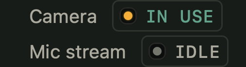

# Dead Air

A macOS menu bar app that mutes the mic, locks the keyboard for cleaning, tells you when the
camera is on, and keeps the Mac awake.

Dead air is the broadcast term for silence that was not supposed to happen. This makes it
deliberate.

Native Swift and AppKit, no dependencies, builds with Command Line Tools alone. No Xcode.


One 64 unit grid, one stroke weight. Only the interior line changes, so live, muted and locked
read as one object doing different things.

## What it does

**Microphone.** Mutes the default input device system-wide, so every app sees silence. Uses
the device's own mute property, falling back to forcing input volume to zero on devices that
do not implement it. Switching to AirPods mid-call re-applies the mute instead of silently
going live. Push to talk temporarily unmutes while you hold a hotkey.

**Cleaning mode.** Blocks the keyboard system-wide with a `CGEventTap`, including media,
volume and brightness keys. Optionally the trackpad too. Holds a power assertion so the
display cannot sleep and lock mid-wipe, and covers the screen in black so smudges show up.


**Camera and mic monitor.** Reports whether the camera or mic is in use, the same signal
behind the green and orange menu bar dots, with a timestamped log and an optional banner.


**Keep awake.** IOKit power assertions with presets from 15 minutes to indefinite and a live
countdown. Optionally lets the display sleep while the system stays awake. A separate toggle
keeps the Mac awake with the lid closed.

## What it cannot do

Both of these are limits of macOS, not of the implementation, and the app says so in its own
About box rather than pretending otherwise.

**It cannot disable the camera.** There is no API. Apple's developer support
[says so directly](https://developer.apple.com/forums/thread/678268). Real blocking needs a
kext (dead on Apple Silicon), a system extension, or MDM. Apps that claim to disable the
camera are manipulating the privacy database, which needs Full Disk Access and breaks on OS
updates. Dead Air reports camera use instead.

**It cannot tell you which app is using the camera or mic.** macOS does not expose it.
Objective Development, who make Little Snitch, confirm the same limitation for
[Micro Snitch](https://www.obdev.at/support/microsnitch/vajq8). Any app name here would be a
guess, so the log deliberately omits it.

## Build

```sh
./build.sh --install     # build, sign, copy to ~/Applications, launch
./build.sh               # build only, lands in build/DeadAir.app
```

Then grant Accessibility, which only cleaning mode needs: System Settings > Privacy &
Security > Accessibility. The app has a **Grant Accessibility access…** item in its own menu
while the permission is missing, which is the reliable way to trigger the prompt.

Muting the mic and monitoring the sensors need no permissions at all.

### Two things that will waste your afternoon

Both of these cost real time here, so they are written down.

**Ad-hoc signing and TCC.** There is no Developer ID certificate, so the app is signed
ad-hoc and its code identity changes when the binary does. macOS can leave a stale
Accessibility entry that still shows as enabled while the app itself is not trusted, so it
keeps asking. Clear it and grant once:

```sh
tccutil reset Accessibility nu.soep.deadair
```

**Never test permissions from a terminal.** Launch the binary from a shell and macOS
attributes the request to the *terminal*, not to the app. If your terminal already has
Accessibility, the app inherits it and every check lies to you:

```
open -a ~/Applications/DeadAir.app --env DEADAIR_SELFTEST=1 --stdout /tmp/ax.txt
  → accessibility granted: false      # the truth, launchd is responsible

./build/DeadAir.app/Contents/MacOS/DeadAir
  → accessibility granted: true       # the terminal's permission leaking in
```

Use `open --env` for anything permission-related.

## Hotkeys

| Action | Shortcut |
| --- | --- |
| Toggle mic mute | `⌃⌥⌘M` |
| Push to talk (hold) | `⌃⌥Space` |
| Toggle cleaning mode | `⌃⌥⌘K` |

Registration fails silently if another app already owns a combination, and **About Dead Air**
lists any that failed. Override with Carbon key codes:

```sh
defaults write nu.soep.deadair "hotkey.toggleMic.keyCode" -int 46
defaults write nu.soep.deadair "hotkey.toggleMic.modifiers" -int 6912
```

Modifiers are a Carbon mask: control `4096`, option `2048`, shift `512`, command `256`.

## Getting out of cleaning mode

Four ways, in order of reliability:

1. **The auto-unlock timer.** 30s, 1m, 5m or none.
2. **Hold both ⌘ keys for 3 seconds.** Read from HID state, so it works even though the tap
   is swallowing the keystrokes.
3. **The Unlock button**, when the trackpad is not locked. Hidden when it is, since the tap
   eats the click too.
4. **Kill the process.** The tap dies with it, so a crash can never lock you out.

Two hard rules: locking the trackpad forces a timeout of at most 5 minutes even if you picked
"no timeout", so the Mac can never be left with no working input. And the power button is
never blocked, macOS reserves it.

## Keeping the Mac awake with the lid closed

**Keep awake > Stay awake with the lid closed.** Not a power assertion but
`pmset -a disablesleep`, which needs root. Rather than install a privileged helper, which
would need a Developer ID certificate, the app runs one authorised command and macOS puts up
its own password dialog, so the password never passes through the app.

It confirms first, because it behaves differently from everything else here: it disables sleep
entirely rather than only the lid, so the Mac stays awake on battery and can get hot in a bag,
and it survives reboots until you switch it off again.

## Smoke test

Builds every menu, exercises the permission-free toggles, and renders every custom view to
PNG, so a layout mistake shows up without clicking through the UI:

```sh
DEADAIR_SELFTEST=1 DEADAIR_UI_DUMP=/tmp/da-ui DEADAIR_ICON_DUMP=/tmp/da-icons \
  ./build/DeadAir.app/Contents/MacOS/DeadAir
```

The renders in this README come out of that hook. It has already caught a legend rendering
flush left and a view being released before it was drawn.

## Design

The identity is documented in [BRAND.md](BRAND.md): palette with enforced roles, three type
roles, the mark geometry for all three states, alternates that were rejected and why, and the
macOS icon constraints. `Sources/DeadAir/Brand.swift` is the implementation of it.

Three colour rules the code is held to: amber is a lamp and never sets type, oxide is the
accent and the dead state, teal only ever means live.



## Layout

| File | Role |
| --- | --- |
| `AppDelegate.swift` | Menu bar item, menu construction, actions, render hooks |
| `Brand.swift` | Colour tokens and type roles, the single source of truth |
| `MicController.swift` | CoreAudio mute, volume fallback, device-change listeners |
| `InputLocker.swift` | Event tap, unlock chord, timeout, safety cap |
| `CleaningOverlay.swift` | Black full-screen cover with countdown |
| `SensorMonitor.swift` | CMIO and CoreAudio in-use polling |
| `ActivationLog.swift` | Persisted activation history |
| `AlertBanner.swift` | Floating warning panel |
| `KeepAwake.swift` | Power assertions and presets |
| `LidSleep.swift` | The one authorised `pmset` call |
| `HotkeyManager.swift` | Carbon global hotkeys with press and release |
| `StatusIcon.swift` | The three marks, drawn as template vectors |
| `MenuLampRow.swift` | The custom tally readout row |

## Licence

MIT, see [LICENSE](LICENSE).
