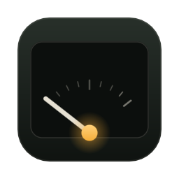
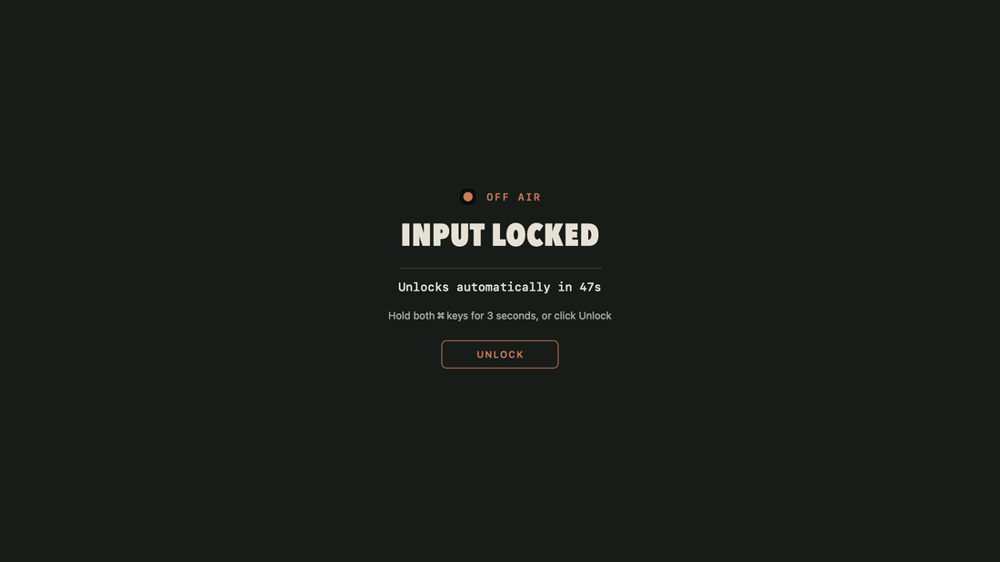
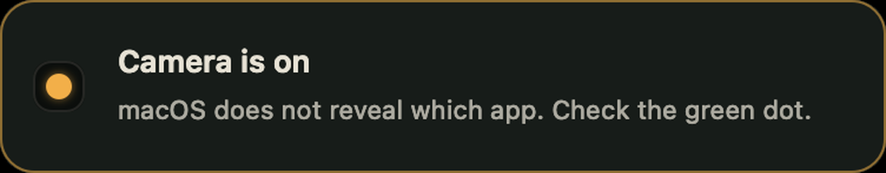

# Dead Air

A macOS menu bar app that combines studio controls with a full system monitor. The studio
side mutes the mic system-wide, locks the keyboard for cleaning, reports when the camera or
mic is in use, and keeps the Mac awake. The monitor side covers CPU, GPU, RAM, disk, network,
battery, sensors, bluetooth and a clock, each as its own menu bar widget with a detail popup.

Dead air is the broadcast term for silence that was not supposed to happen. This makes it
deliberate.


One 64 unit grid, one stroke weight. Only the interior line changes, so live, muted and
locked read as one object doing different things.

## What it does

**Microphone.** Mutes the default input device system-wide, so every app sees silence. Uses
the device's own mute property, falling back to forcing input volume to zero on devices that
do not implement it. Switching to AirPods mid-call re-applies the mute instead of silently
going live. Push to talk temporarily unmutes while you hold a hotkey.

**Cleaning mode.** Blocks the keyboard system-wide with a `CGEventTap`, including media,
volume and brightness keys. Optionally the trackpad too. Holds a power assertion so the
display cannot sleep and lock mid-wipe, and covers every screen in black so smudges show up.



**Camera and mic monitor.** Reports whether the camera or mic is in use, the same signal
behind the green and orange menu bar dots, with a timestamped log, an optional banner, and an
eight hour timeline of how much each has actually been running.



**Keep awake.** IOKit power assertions with presets from 15 minutes to indefinite, a live
countdown and a meter for the remaining time. Optionally lets the display sleep while the
system stays awake. A separate toggle keeps the Mac awake with the lid closed.

**System monitor.** The nine monitor modules from [Stats](https://github.com/exelban/stats),
each with its own menu bar widget, popup and settings, restyled to this app's identity.

## What it cannot do

All three are limits of macOS, not of the implementation.

**It cannot disable the camera.** There is no API. Apple's developer support
[says so directly](https://developer.apple.com/forums/thread/678268). Real blocking needs a
kext (dead on Apple Silicon), a system extension, or MDM. Apps that claim to disable the
camera are manipulating the privacy database, which needs Full Disk Access and breaks on OS
updates. Dead Air reports camera use instead.

**It cannot tell you which app is using the camera or mic.** macOS does not expose it.
Objective Development, who make Little Snitch, confirm the same limitation for
[Micro Snitch](https://www.obdev.at/support/microsnitch/vajq8). Any app name here would be a
guess, so the log deliberately omits it.

**It has no input level meter.** Metering a microphone means opening it, which needs
microphone permission and lights the orange indicator. An app whose point is that it needs no
permission to watch the mic cannot have one, so the panel charts how long the mic was in use
instead of how loud it was.

## Install

Grab the zip from [Releases](https://github.com/Nah-Nova/dead-air/releases), unzip, and put
`Dead Air.app` in `/Applications`. Universal, Apple Silicon and Intel, macOS 12 or later.
The desktop widgets need macOS 14.

**You must clear quarantine, or it will not open.** There is no Developer ID certificate
behind this, so the app is signed ad-hoc and not notarised, and macOS refuses a downloaded
bundle in that state:

```sh
xattr -dr com.apple.quarantine "/Applications/Dead Air.app"
```

If you would rather not run that, open System Settings > Privacy & Security after the first
failed launch and press **Open Anyway**. Right-click then Open no longer works for an
unnotarised app on current macOS.

Verify what you downloaded before you trust it, the checksum is in the release notes:

```sh
shasum -a 256 "Dead Air-2.0.0-universal.zip"
```

## Permissions

The only permission the app asks for is Accessibility, and only cleaning mode needs it:
System Settings > Privacy & Security > Accessibility. Muting the mic, monitoring the sensors
and every system readout need nothing at all.

**Accessibility has to be granted again after every update.** Ad-hoc signing ties the
approval to one exact binary, so a new version no longer matches and macOS keeps the old
entry while refusing the new app. Cleaning mode detects that and offers **Clear and ask
again**, which drops the stale approval and re-asks in one step.

## Hotkeys

| Action | Shortcut |
| --- | --- |
| Toggle mic mute | `⌃⌥⌘M` |
| Push to talk (hold) | `⌃⌥Space` |
| Toggle cleaning mode | `⌃⌥⌘K` |

Registration fails silently if another app already owns a combination. Override with Carbon
key codes:

```sh
defaults write nu.soep.deadair "hotkey.toggleMic.keyCode" -int 46
defaults write nu.soep.deadair "hotkey.toggleMic.modifiers" -int 6912
```

Modifiers are a Carbon mask: control `4096`, option `2048`, shift `512`, command `256`.

## Getting out of cleaning mode

Four ways, in order of reliability:

1. **The auto-unlock timer.** 30s, 1m, 5m or none.
2. **Hold both ⌘ keys for 3 seconds.** Read from HID state, so it works even though the tap
   is swallowing the keystrokes.
3. **The Unlock button** on the overlay, when the trackpad is not locked. Hidden when it is,
   since the tap eats the click too.
4. **Kill the process.** The tap dies with it, so a crash can never lock you out.

Two hard rules: locking the trackpad forces a timeout of at most 5 minutes even if you picked
"no timeout", so the Mac can never be left with no working input. And the power button is
never blocked, since the tap passes that one event through on purpose.

The timeout and the chord are enforced twice: once on the run loop that draws the countdown,
and once from a background watchdog, so a modal dialog appearing while input is locked cannot
stall the way out.

## Keeping the Mac awake with the lid closed

**Keep awake > Stay awake with the lid closed.** Not a power assertion but
`pmset -a disablesleep`, which needs root. Rather than install a privileged helper, which
would need a Developer ID certificate, the app runs one authorised command and macOS puts up
its own password dialog, so the password never passes through the app.

It confirms first, because it behaves differently from everything else here: it disables sleep
entirely rather than only the lid, so the Mac stays awake on battery and can get hot in a bag,
and it survives reboots until you switch it off again.

## Build

Building needs full Xcode, not just the Command Line Tools. Every target signs ad-hoc by
default, so this works without a Developer ID certificate.

```sh
xcodebuild -project DeadAir.xcodeproj -scheme "Dead Air" -configuration Release \
  -derivedDataPath build/DerivedData build
```

Then sign the result ad-hoc and copy it to `/Applications`:

```sh
codesign --force --deep -s - "build/DerivedData/Build/Products/Release/Dead Air.app"
cp -R "build/DerivedData/Build/Products/Release/Dead Air.app" /Applications/
```

The Makefile wraps the same steps, installing to `~/Applications` instead:
`make build sign install`. Tests run with
`xcodebuild test -project DeadAir.xcodeproj -scheme "Dead Air" -destination 'platform=macOS'`.

## Design

The identity is documented in [BRAND.md](BRAND.md): the palette with enforced roles, three
type roles, the geometry of every mark, the bento surfaces the popups are built from, and the
alternates that were rejected and why. `Kit/Brand.swift` is the implementation, and it is the
only place a colour or a font is defined.

Three colour rules the code is held to: amber is a lamp and never sets type, oxide is the
accent and the dead state, teal only ever means live.

## Licence

MIT, see [LICENSE](LICENSE).

Built on the [Stats](https://github.com/exelban/stats) system monitor by Serhiy Mytrovtsiy,
MIT licensed, with the original licence preserved in [LICENSE-stats](LICENSE-stats).
